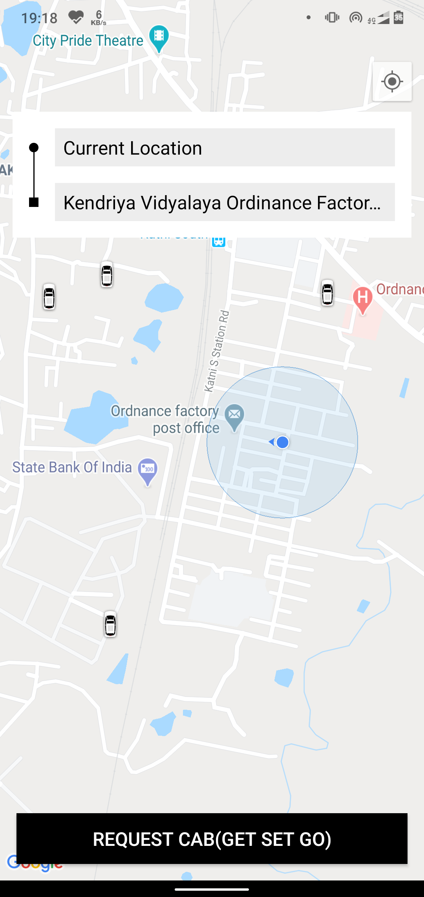
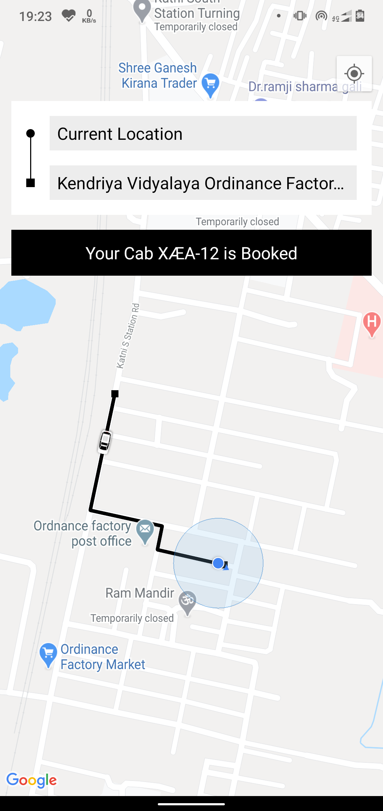
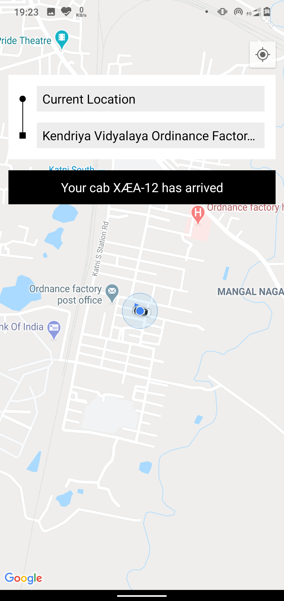
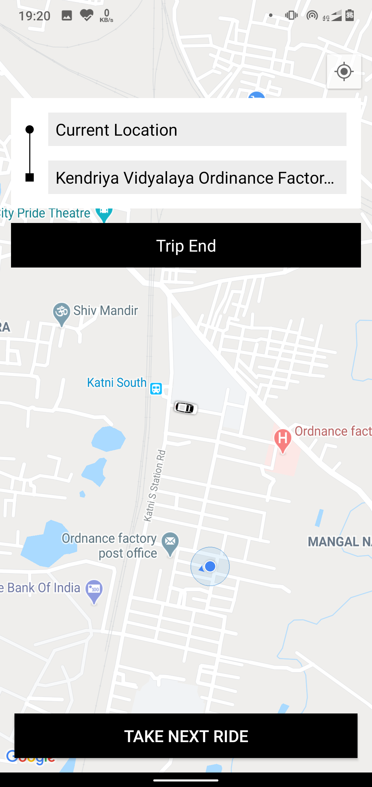

# Ride-Sharing-Project 

## This is Android project based on Cab Service Utilities , MVP Architecture with the help of Google Maps API

## `Screen Shots`

<table style="padding:10px">
  <tr>
    <td> 
         </td>
      
 <td></td>
   <td></td>
    
   <!--<td></td>-->
  </tr>
</table>

